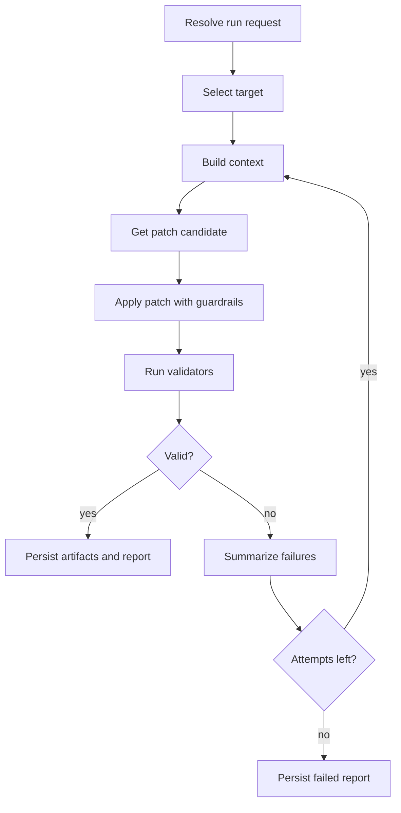

# AIUnitTest v2 Architecture

This document defines the concrete architecture for the v2 tool-first redesign.

## Architectural stance

- the core must work without a terminal UI
- the CLI is a client of the core, not the core itself
- reasoning backends are adapters, not the product
- MCP is a future surface over stable core capabilities, not a second implementation
- validation and reporting are part of the primary execution path

## Delivery rule

The architecture is hybrid, but implementation should be phased.

The product should not try to ship CLI, CI, PR automation, and MCP at the same maturity level.
The core workflow and CLI client must stabilize first, and every later surface should reuse that same engine.

## Layered architecture

### 1. Core engine

The core engine owns the testing workflow and domain rules.

Responsibilities:

- normalize a testing target
- build a minimal context bundle
- accept a patch candidate from a backend or external agent
- apply the patch with guardrails
- run validators
- summarize failures for retries
- persist artifacts and reports

Planned package shape:

```text
src/ai_unit_test/v2/
  models.py
  orchestrator.py
  targeting/
    selectors.py
  context/
    builder.py
  backends/
    base.py
    copilot_cli.py
    gemini_cli.py
  patching/
    workspace.py
  validation/
    runners.py
    feedback.py
  reporting/
    renderer.py
    store.py
  cli.py
  mcp/
    server.py
```

### 2. Backend adapters

Backend adapters translate a `ContextBundle` into a patch proposal.

Initial adapters:

- Copilot CLI backend
- Gemini CLI backend

Responsibilities:

- format backend-specific prompts or requests
- invoke the external runtime
- normalize the response into a `PatchCandidate`
- preserve backend name and plan summary for reporting

Backends own general reasoning.
They do not own target selection, validator choice, retry policy, or reporting.

### 3. Client surfaces

The same core engine should serve multiple clients.

#### CLI client

The first shipping client.

Responsibilities:

- parse user intent into a run request
- choose backend and flags
- print terminal summaries
- expose JSON output when requested

#### CI and PR runner

Secondary client after local mode is stable.

Responsibilities:

- run the same workflow headlessly
- save artifacts for CI
- publish markdown summaries for pull requests

#### Future MCP server

Longer-term client surface for external agents.

The MCP layer should expose stable testing capabilities from the core rather than reimplementing logic.
It should start with coarse, high-value tools and only later expose finer-grained utilities.

Possible first MCP tools:

- `select_test_targets`
- `build_test_context`
- `validate_test_patch`
- `get_last_run_report`

## Core components and interfaces

### Target Selector

Responsible for deciding what the tool is trying to fix.

Inputs:

- uncovered lines
- git diff
- explicit file or symbol selection
- failing tests

Output:

- prioritized `TargetSpec` values with rationale

Planned interface:

```python
class TargetSelector(Protocol):
    def select(self, request: RunRequest) -> list[TargetSpec]: ...
```

### Context Builder

Responsible for building the minimum but sufficient context for reasoning.

Inputs:

- selected target
- source files
- related tests
- project config
- coverage data
- recent validator output

Output:

- `ContextBundle`

Planned interface:

```python
class ContextBuilder(Protocol):
    def build(self, target: TargetSpec, feedback: list[str] | None = None) -> ContextBundle: ...
```

### Reasoning Backend

Responsible for turning context into a patch candidate.

Planned interface:

```python
class ReasoningBackend(Protocol):
    name: str

    async def propose_patch(self, context: ContextBundle) -> PatchCandidate: ...
```

### Patch Applier

Responsible for applying candidate patches in a controlled way.

Responsibilities:

- stage the patch in a controlled workspace
- record touched files
- preserve a diff for reporting
- refuse unsafe writes unless explicitly allowed

Planned interface:

```python
class PatchApplier(Protocol):
    def apply(self, candidate: PatchCandidate, request: RunRequest) -> PatchApplication: ...
```

Guardrails for the first cut:

- default to test-file edits only
- require opt-in for source-file edits
- persist diff artifacts for every run

### Validation Engine

Responsible for deciding whether a patch is acceptable.

Mandatory validators for the first cut:

- Python syntax validation for touched files
- targeted pytest execution

Optional validators after the first cut:

- formatting
- linting
- coverage comparison

Planned interface:

```python
class Validator(Protocol):
    def run(self, application: PatchApplication, target: TargetSpec) -> ValidationResult: ...
```

### Repair Loop Controller

Responsible for bounded iteration.

If validation fails, the controller should:

- summarize what failed
- attach that summary to the next context bundle
- request a revised patch
- stop after a configured attempt limit

## Non-negotiable operational guardrails

These rules should be enforced by the core, not left to backend prompts:

- retries must be bounded
- every run must persist artifacts for auditability
- validator failures must be structured before being sent back to a backend
- source-file edits must remain opt-in
- the engine must not auto-commit, auto-push, or auto-merge changes
- ambiguous validation states should be treated as failures, not soft success

### Reporter and artifact store

Responsible for final output and traceability.

Every run should persist:

- `report.json`
- `summary.md`
- `patch.diff`
- optional raw validator logs

Suggested local artifact layout:

```text
.ai-unit-test/
  runs/
    <run-id>/
      report.json
      summary.md
      patch.diff
      validator.log
```

## Execution flow



## Two supported reasoning paths

The architecture should support both of these without splitting the product.

### Internal-backend path

AIUnitTest drives the workflow and calls a backend such as Copilot CLI or Gemini CLI.
This is the first path to ship through the CLI.

### External-agent path

An external agent uses AIUnitTest through MCP or another tool interface.
In this path, AIUnitTest should expose its durable strengths:

- target selection
- context synthesis
- patch validation
- run reporting

The external agent can remain the reasoner while AIUnitTest remains the testing engine.

## CLI shape during incubation

The v1 commands should remain untouched while v2 is unstable.
The concrete incubation command shape should be:

```text
ai-unit-test v2 run --file path/to/module.py --backend copilot-cli
ai-unit-test v2 run --diff --backend gemini-cli
ai-unit-test v2 run --failing-test tests/unit/test_module.py::test_case --backend copilot-cli
ai-unit-test v2 report --last-run
ai-unit-test v2 backends list
ai-unit-test v2 doctor
```

Useful early flags:

- `--max-attempts`
- `--dry-run`
- `--json`
- `--allow-source-edits`

## Migration strategy

v1 should remain available while v2 is incubated.

Recommended approach:

- keep current commands intact
- incubate v2 in a dedicated namespace and command surface
- avoid mixing v1 and v2 workflows until the validation loop is usable
- switch the public default only after real benchmarks prove the new path
